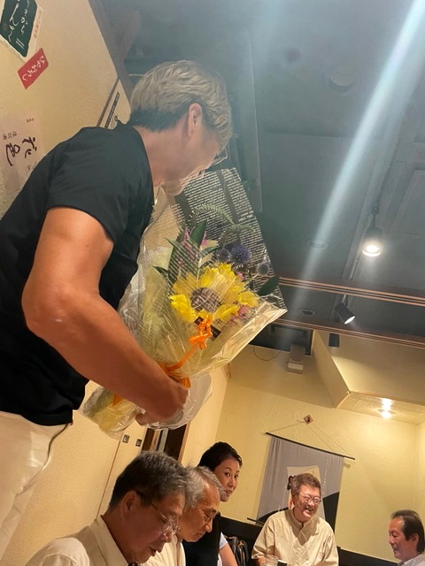

# fts_4

<html lang="ja">
 <head>
  <meta charset="utf-8" />
	 

<link href="https://cdnjs.cloudflare.com/ajax/libs/lightbox2/2.7.1/css/lightbox.css" rel="stylesheet">
 
</head>
<body>

<a href="https://torokoid.github.io/fts_home">Home</a>><a href="https://torokoid.github.io/fts">同窓会</a>><a href="https://torokoid.github.io/fts_2">Teams同窓会</a>><a href="https://torokoid.github.io/fts_3">Teams同窓会_2</a>>リアル同窓会_2

<h1><marquee behavior="alternate">!!! 2022年7月11日(月)リアル安否確認会の記録＠神田「岬」 !!!</marquee></h1>

                            
	

                                       

  

 

<!-- フッタ -->
 <footer>
 Copyright 2022/07/12 S.Hada
 </footer>
